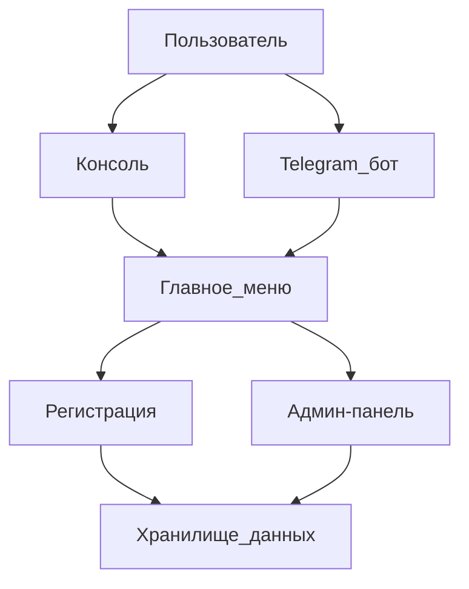

# Чатбот регистрации на мероприятие

Проект Python чатбота для регистрации участников на мероприятие.

## Функционал

- Собирание данных: ФИО, email, телефон, название организации
- Валидация email и телефона
- Сохранение регистраций в JSON файл
- Два модуля: консоль и Telegram бот

## Архитектура проекта

```
event_registration_bot/
├── config/
│   └── settings.py          # Настройки приложения
├── data/
│   └── registrations.json   # JSON файл с регистрациями
├── models/
│   └── registration.py      # Модель данных регистрации
├── validators/
│   └── validators.py       # Функции валидации
├── storage/
│   └── json_storage.py     # Сохранение в JSON
├── interfaces/
│   ├── console_interface.py # Консоль
│   └── telegram_bot.py     # Telegram бот
├── requirements.txt     # Зависимости
├── main.py              # Маин-скрипт
└── README.md
```

## Установка

```bash
pip install -r requirements.txt
```

## Запуск

На консоли:
```bash
python main.py
```

На Telegram (нужно указать токен в .env ныли в config/settings.py):
Выберите опцию 2 в меню

## Копирайт

Чатбот регистрации на мероприятие. 2025.

## Админ-меню

Для доступа к админ-меню:
- Выберите опцию 3 в главном меню
- Введите пароль: **1234**
- На консоли: команда 'admin' в меню
- На Telegram: команда '/admin'

В админ-меню можно:
- Посмотреть статистику (всего регистраций, размер БД)
- На консоли: 1 - все данные
- Цию: '0' для выхода

## Архитектура с Mermaid диаграммой



## Новая архитектура с кнопками

### Главное меню

После запуска бота пользователь видит главное меню со статусом и 4 кнопками:

**Кнопки:**
- 📝 Регистрация - регистрация нового пользователя
- 🔑 Логин - вход в систему
- 📋 Список мероприятий - просмотр доступных мероприятий
- ⚙️ Админ-панель - доступ к административным функциям

**Отображаемый статус:**
```
Статус: Не залогирован
Зарегистрирован на: -
```

или (после входа)

```
Статус: Залогирован ✅
Пользователь: Иван Петров
Зарегистрирован на:
  • Конференция 2025
  • Вебинар Python
  • Митап DataScience
```

### Процесс регистрации и входа

1. Пользователь нажимает кнопку "Регистрация" или "Логин"
2. Проходит процесс регистрации/входа
3. После завершения **автоматически возвращается в главное меню** с обновленным статусом

### Список мероприятий

При нажатии кнопки "Список мероприятий" отображаются **динамические кнопки** для каждого мероприятия:

```
🎫 Зарегистрироваться на Конференцию 2025
🎫 Зарегистрироваться на Вебинар Python
🎫 Зарегистрироваться на Митап DataScience
⬅️ Назад в меню
```

После регистрации на мероприятие пользователь возвращается в список мероприятий или главное меню.

### Навигация

В каждом меню есть кнопка **"Назад"** или **"В главное меню"** для возврата на предыдущий уровень.
