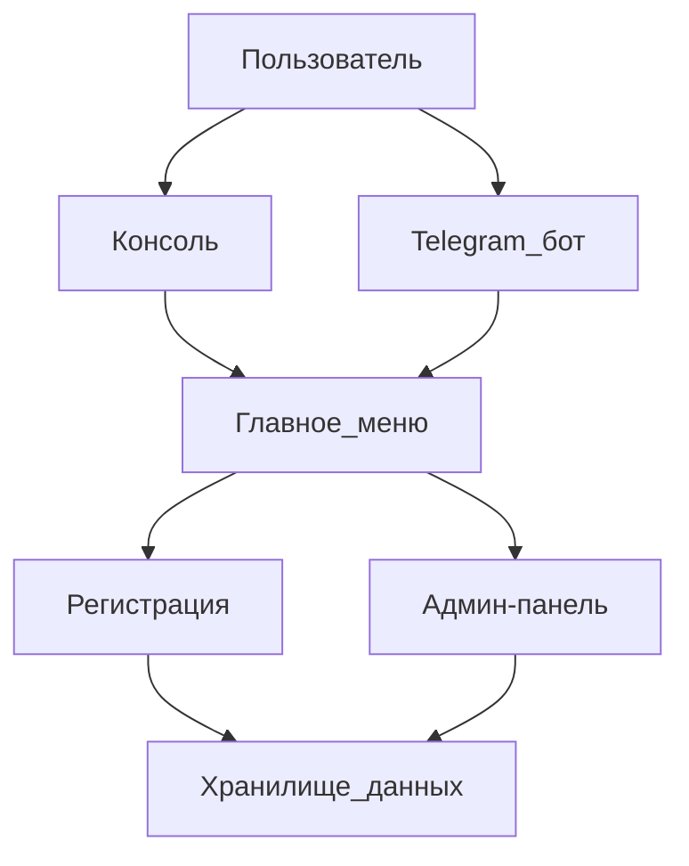

# Чатбот регистрации на мероприятие

Проект Python чатбота для регистрации участников на мероприятие.

## Функционал

- Собирание данных: ФИО, email, телефон, название организации
- Валидация email и телефона
- Сохранение регистраций в JSON файл
- Два модуля: консоль и Telegram бот

## Архитектура проекта

```
event_registration_bot/
├── config/
│   └── settings.py          # Настройки приложения
├── data/
│   └── registrations.json   # JSON файл с регистрациями
├── models/
│   └── registration.py      # Модель данных регистрации
├── validators/
│   └── validators.py       # Функции валидации
├── storage/
│   └── json_storage.py     # Сохранение в JSON
├── interfaces/
│   ├── console_interface.py # Консоль
│   └── telegram_bot.py     # Telegram бот
├── requirements.txt     # Зависимости
├── main.py              # Маин-скрипт
└── README.md
```

## Установка

```bash
pip install -r requirements.txt
```

## Запуск

На консоли:
```bash
python main.py
```

На Telegram (нужно указать токен в .env ныли в config/settings.py):
Выберите опцию 2 в меню

## Копирайт

Чатбот регистрации на мероприятие. 2025.

## Админ-меню

Для доступа к админ-меню:
- Выберите опцию 3 в главном меню
- Введите пароль: **1234**
- На консоли: команда 'admin' в меню
- На Telegram: команда '/admin'

В админ-меню можно:
- Посмотреть статистику (всего регистраций, размер БД)
- На консоли: 1 - все данные
- Цию: '0' для выхода

## Архитектура с Mermaid диаграммой



## Новая архитектура с кнопками

### Главное меню

После запуска бота пользователь видит главное меню со статусом и 4 кнопками:

**Кнопки:**
- 📝 Регистрация - регистрация нового пользователя
- 🔑 Логин - вход в систему
- 📋 Список мероприятий - просмотр доступных мероприятий
- ⚙️ Админ-панель - доступ к административным функциям

**Отображаемый статус:**
```
Статус: Не залогирован
Зарегистрирован на: -
```

или (после входа)

```
Статус: Залогирован ✅
Пользователь: Иван Петров
Зарегистрирован на:
  • Конференция 2025
  • Вебинар Python
  • Митап DataScience
```

### Процесс регистрации и входа

1. Пользователь нажимает кнопку "Регистрация" или "Логин"
2. Проходит процесс регистрации/входа
3. После завершения **автоматически возвращается в главное меню** с обновленным статусом

### Список мероприятий

При нажатии кнопки "Список мероприятий" отображаются **динамические кнопки** для каждого мероприятия:

```
🎫 Зарегистрироваться на Конференцию 2025
🎫 Зарегистрироваться на Вебинар Python
🎫 Зарегистрироваться на Митап DataScience
⬅️ Назад в меню
```

После регистрации на мероприятие пользователь возвращается в список мероприятий или главное меню.

### Навигация

В каждом меню есть кнопка **"Назад"** или **"В главное меню"** для возврата на предыдущий уровень.


## 📊 Архитектура логирования и алертинга

### 1. Структура БД для логов (logs)

Основные поля таблицы:
- `id` (UUID) - уникальный идентификатор
- `timestamp` (TIMESTAMPTZ) - время события
- `level` (VARCHAR) - DEBUG, INFO, WARNING, ERROR, CRITICAL
- `message` (TEXT) - описание события
- `user_id` (BIGINT NULL) - ID пользователя
- `event_type` (VARCHAR) - REGISTRATION_SUCCESS, VALIDATION_ERROR, ADMIN_LOGIN, DB_FAILURE
- `context_data` (JSONB) - структурированные данные
- `source` (VARCHAR) - TELEGRAM, CONSOLE, ADMIN_PANEL, SYSTEM
- `stack_trace` (TEXT NULL) - трассировка ошибок
- `session_id` (VARCHAR) - ID сессии пользователя

Индексы: timestamp DESC, level, event_type, user_id

Retention Policy (политика хранения):
- DEBUG: 7 дней
- INFO/WARNING: 30 дней
- ERROR/CRITICAL: 90 дней
- Автоматическая очистка через фоновый worker

### 2. Архитектура алертинга

Таблица alert_rules (правила алертов):
- `id` - ID правила
- `name` - название (например: "Частые ошибки валидации")
- `condition` - условия JSONB: {"level": "ERROR", "threshold": 5, "period_minutes": 10}
- `channels` - каналы: ["telegram", "email", "console"]
- `is_active` - активность правила

Таблица alerts (сами алерты):
- `id` - уникальный ID
- `rule_id` - ссылка на alert_rules
- `triggered_at` - время срабатывания
- `message` - текст алерта
- `status` - PENDING, SENT, FAILED
- `retry_count` - количество попыток

Каналы отправки: console (stderr), telegram (админам), email (SMTP), prometheus (Grafana)

### 3. Уровни логирования

- DEBUG - детальная отладка (примеры: дамп данных API)
- INFO - штатные операции (примеры: успешная регистрация, вход в админку)
- WARNING - потенциальные проблемы (примеры: неверный пароль)
- ERROR - обрабатываемые исключения (примеры: ошибка валидации, сбой БД)
- CRITICAL - критические сбои (примеры: недоступность БД)

### 4. События логирования для бота

События регистрации:
- REGISTRATION_SUCCESS (INFO) - успешная регистрация
- VALIDATION_ERROR (WARNING) - ошибка валидации
- REGISTRATION_CANCELLED (INFO) - отмена
- REGISTRATION_FAILED (ERROR) - критический сбой

События админ-меню:
- ADMIN_LOGIN_SUCCESS (INFO) - успешный вход
- ADMIN_LOGIN_FAILURE (WARNING) - неверный пароль
- ADMIN_DATA_EXPORT (INFO) - экспорт данных

Системные события:
- SYSTEM_STARTUP (INFO) - запуск бота
- DB_RECONNECT (WARNING) - переподключение к БД
- SYSTEM_CRASH (CRITICAL) - критический сбой

### 5. Особенности реализации

- Контекстные логи: все логи в рамках сессии имеют session_id
- Маскировка данных: автоматическое скрытие email/телефонов в context_data
- Асинхронность: запись логов не блокирует основной поток
- Тестирование: режим TEST_LOGGING для валидации структуры
- Триггеры: анализ логов каждые 1-5 минут по правилам
